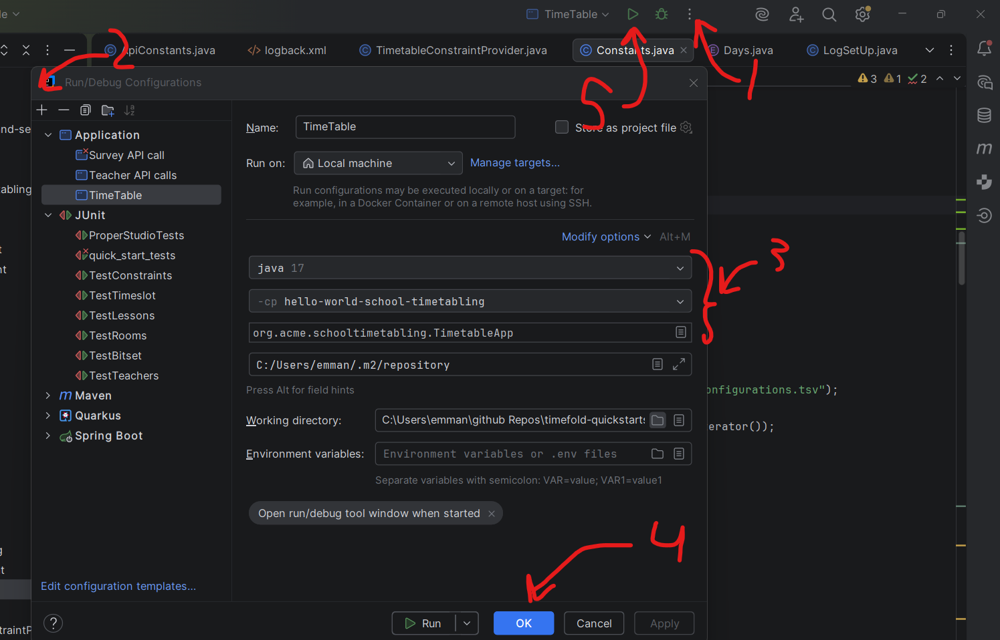

# Department Scheduling Optimization System
This project has two main parts: the Java scheduling engine, which constructs semester schedules while enforcing constraints, and the backend, which stores instructor information such as names, emails, and survey responses.

The documentation below is a quick setup guide to getting started.

Before we get started note that I might use the words teachers and instructors interchangeably. 
Also, when I use the word faculty, I use it to refer to instructors that need time off during a certain time of the week because they are tenured or on track.

## Java Engine
For the in dpeth scheduling engine documentation go [here](java/hello-world/README.md)  
**When working with the Java engine in Intellij, open the project up from this directory.**

To utlize the Java engine you will need to have Java 17 on your system. Currently the java engine will require an IDE
so you can run the tool I've created. The IDE I will be showing in the guide will be IntelliJ. The software will also log
important information related to what it is doing.

Nescessary files and location placement (Note file names are case sensitive and if a slug is include then it will be denoted as `<slug>`). 
The software/tool will fall back to using the files in the case a connection can't be created, so it can be useful to include all the files.

__Files necessary if using the backend:__
- `.env` in [java/hello-world/src/main/resources](java/hello-world/src/main/resources). The backend has authentication include, so the following enviornment variables are needed.
An example .env file has also been given at the linked location
  - API_USER_PASSWORD
  - API_USER

__Files necessary if not using the backend:__
- Previous term survey: `<prev_term>_survey.csv` in 
[java/hello-world/src/main/resources/input/](java/hello-world/src/main/resources/input/). 
An example file is given called  `term_survey.example.csv` in the location. 
Note the order of the header is important for proper parsing.
- Current term survey: `<cur_term>_survey.csv` in 
[java/hello-world/src/main/resources/input](java/hello-world/src/main/resources/input). 
An example file is given called `term_survey.example.csv` in the location. 
Note the order of the header is important for proper parsing.

__Files necessary regardles of backend usage:__
- Configuration for engine: `config.yaml` in 
[java/hello-world/src/main/resources/constants/](java/hello-world/src/main/resources/constants/).
An example file is given.
- Tells us who teaches what: `schedule-<cur_term>-<department>` in
[java/hello-world/src/main/resources/input/](java/hello-world/src/main/resources/input/). 
An example file is given at the location.
- Course name to configuration (already given): `semester-configurations.tsv` in 
[java/hello-world/src/main/resources/constants/](java/hello-world/src/main/resources/constants/).
- File encoiding possible times (already given): `possibleTimes.csv` in
[java/hello-world/src/main/resources/constants/](java/hello-world/src/main/resources/constants/).
- Univesity site information of faculty: `faculty_website_list.tsv` 
[java/hello-world/src/main/resources/constants/](java/hello-world/src/main/resources/constants/).
No example file given.
- Instructor name to canon file: `name_mappings.xlsx` in [java/hello-world/src/main/resources/constants/](java/hello-world/src/main/resources/constants/). 
No example file is given here but the column order for the file is `email,name,canon`.


__Optional Files:__
- `your_name_choice.json` [java/hello-world/src/main/resources/input/](java/hello-world/src/main/resources/input/). 
An example file has been given for you to understand the formatting.
This file can be included if you want to add in prescheduled times.
For example, an instructor was scheduled in another department.

Note I'll give you some of the files that aren't included.

__Running the application__  
Once you have all those files in place you are ready to run the application. 
Simply run [TimetableApp.java](java/hello-world/src/main/java/org/acme/schooltimetabling/TimetableApp.java) and the solutions will be printed out into your workind directory into a folder called `generated`. 
The file name will be `<term>_<department>_solution.xlsx`.
There will also be a file called `times_<timestamp>.json`, which will encode the times an instructor has been scheduled into a JSON file.

**Note that I have added the configuraiton to run the application**. 
You should be able to select it by hitting the drop down menu next to the button marked in step 5 in the guide below.
If no such thing exists, then follow the setup guide below.

**Example intellij setup.**  
In step 1 you will see pop up. Select `edit` under configuration.  
In step 2 you will see a menu and you should choose the `Application` option.  
In step 3 you will select the same options you see in the image.


For more information on how the Java scheduling engine works look at this [README file](java/hello-world/README.md)  

## Backend (in the backend directory)
For the backend focused documentation go [here](backend/README.md)  
The workspace for all backend realated stuff is `backend`  
Note that all the backend APIs are protected and therefore you will need to login to get your JWT tokens.

__Prerequisites:__
- **Python >= 3.10 and Poetry**
  - I recommend running the command `poetry config virtualenvs.in-project true` because the enviornment will be created in the project folder.
  This allows you to select the interpreter from the poetry virtualenv for better development.
  - A [guide](https://python-poetry.org/docs/) for poetry setup
- **Docker**
  - installation [documentation](https://docs.docker.com/engine/install/)

__Files needed:__
- .env placed at `backend` [directory](backend)
```bash
# required
PGADMIN_PASSWORD
POSTGRES_PASSWORD
# optional (defaults shown). For the purpose of the setup leave them out.
POSTGRES_USER=admin
POSTGRES_DB=scheduling
# change if you like
PGADMIN_EMAIL=example@example.com
```
- .env placed at `backend/django_backend/scheduling_backend` [directory](backend/django_backend/scheduling_backend)
```bash
# required
POSTGRES_HOST=localhost
POSTGRES_PASSWORD
```

Start the Docker services from within the `backend` folder by running:
```bash
docker compose up -d
poetry env use python3
poetry install
```

This should start of up the PostgreSQL (database), pgadmin (monitoring), and the Django backend.
Note that the suetup will mount the `backend/django_backend` directory into the continaer so development inside that directory on your host machine will be reflected in the container and vice versa

**Setting up the Database**  
If you have been given a `.dump` file then we can use it create our database tables and populate them by doing the following:
```bash
# This is assuming you kept the default in the .env file in your backend
# If this fails to run it could be because you have something else connected to the database
docker exec -i postgres-service pg_restore -d scheduling -U admin --clean --create < db.dump
```

__Running the backend__  
In either option the Java scheduling engine will assume that the server is listening on port `8002`

Option 1: Docker
```bash
#first command necessary if container isn't running
docker start 
docker exec -it django_service bash
#you should now be in the continaer
cd scheduling_backend/
poetry run python -m manage run server 0.0.0.0:8002
```
Option 2: host machine  
Navigate to `backend/django_backend/scheduling_backend` and run
```
poetry run python -m manage run server 0.0.0.0:8002
```

## Contributing
To keep the code base organized and reduce uncessary conflicts, don't push directly to stable and instead follow the guide below
1. Pull the lastest `stable` branch
```
git checkout stable
git pull stable
```
2. Create your own branch from `stable`
```
git checkout -b your_feature
```
3. Make your updates and push them to your branch
```
git add .
git commit -m "your helpful commit message"
git push
```
4. Make your pull request. This will trigger a CI workflow which will run tests


## What's next
- Refactor the Java engine file structure so tests can run in CI using the correct resource directories.
- Ensure ingested backend files always include correct instructor emails. The backend supports this, but the relevant code is currently commented out.
