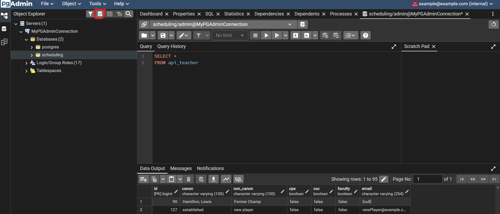
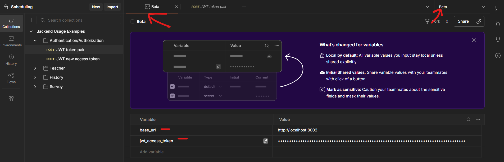
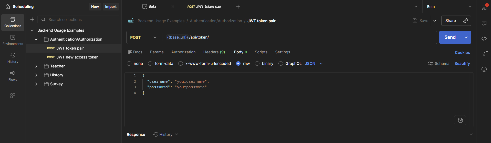

# Backend workspace
This workspace is soley dedicated to the backend. 
The backend has the default settings to include authentication using JWT tokens on all api endpoints.
In other words, and access token will be needed for accessing all api endpoints unless the api endpoint explicitly disabled auth. On top of authentication, authorization is also enabled across all endpoints using role based access control (RBAC). 

Roles can be created, managed, and assigned through the django admin. Furthermore, users can be created and managed through the django admin.

This guide of the backend will assume that you have everything backend related already setup from the [README](../README.md) file in the repo root.

# PostgreSQL DB
The databse default name where everything is stored is called `scheduling` unless you otherwise specified in the `.env` file used when creating the service.

There are 3 main tables called `api_history`, `api_teacher`, and `api_survey`.  
The `teaher` table contains information about the teachers.  
The `history` table keeps a record of names that teachers have had before.   
This table has a many-to-one relationship to the `teacher` table.
The `survey` table keeps a record of surveys a teacher has.   
This table has a many-to-one relationship to the `teacher` table. 


The other tables you will encounter in the scheduling database are those setup by django to handle permissions and users.

For information about the columns look at the pgAdmin [section](#pgadmin) to learn about inspecting the tables.

Note that when we are backing up or restoring the DB we shouldn't have anything connected to the database  
__Backing up the DB__  
`docker exec postgres-service pg_dump -Fc -U admin scheduling > db.dump`

__Restoring the DB from a backup__  
`docker exec -i postgres-service pg_restore -d postgres -U admin --clean --create < db.dump`

Note that when using the commands, you can't be connected to the scheduling database. It must be some other db. If you want to know what db's are available,
run the command `docker exec -it postgres-service psql -U admin -d scheduling` to open a connection and shell in the container.
Then type `\l` to see the available DBs.

# pgAdmin
PG admin is one of the services created in the docker compose file. 
This can be used to check what databases are setup, what tables exist, run SQL queries on a database, and many other things. 
In order to do those things go to `http://localhost:15432/login?next=/` to log into your pgAdmin account.
Your credentials should be those from your .env file used when running `docker compose up`. The default username/email is example@example.com.

Once you have loged in:  
1. In the Object Explorer side tab we will right click Servers -> register -> server. 
Then you should see a window appear.
2. In the `general` tab, give you server a name. It can be any name.
3. Navigate to the `Connection` tab.
Then enter `db` for the host name and enter the username and password from your `.env` file used for docker compose. 
If your `.env` file didn't have a username then the default will be `admin`.
4. toggle the `Save password?` on, so we don't have to reenter our password.
5. Save the server. If you have an error make sure PostgreSQL is running.
6. Expand the new server you created, expand the databases, and select the scheduling database.
7. In the tool bar in the Object Explorer pane, click the button that looks like the database with a play button
8. You should see a new tab open that will allow you to run SQL queries and see the results of those queries

To inspect the tables click on servers -> the server you just setup -> Databases -> scheduling -> Schemas -> public -> Tables

Example setup



# The Django Backend
__Quick overview__

The api endpoint for getting tokens is `{base_url}/api/token`.  
The teacher endpoints are at ```{base_url}/api/teachers/```.  
The survey endpoints are at ```{base_url}/api/surveys/```.  
The history endpoints are at ```{base_url}/api/history/```.  

Another `.env` file will be needed for the backend as mentioned in the README file in the root directory. 
The location of this is basically wherever you launch the `manage.py` in `django_backend/scheduling_backend`. 
However, my instructions assume you have it in the same directory as `manage.py` (`./django_backend/scheduling_backend/`)

All Django related files are in the `./django_backend/scheduling_backend` directory

API endpoint documentation is all in the Postman workspace or upload this 
[file](./documentation_media/backend_postman_docs.json) to your postman workspace. 
When using the workspace make sure create and enviornment and the variables `base_url` and `jwt_access_token` are in it.
To get your access token, use the `JWT token pair` request example and copy the access token into your enviornemnt.

Examples




__Creating users and permissions__  
If you setup the database with a `.dump` file given to you, you should have a superuser already. Otherwise run the following command
from the `./django_backend/scheduling_backend/` directory: `poetry run python -m manage createsuperuser`.

Once you have a superuser go to http://localhost:8002/admin, port may vary depending on the port you gave when running the server.
Log into the admin portal and you should now be able manage users and persmissions

# Django Admin Portal

The Django admin portal provides a built-in interface for managing users and permissions within the application.

Through this portal, administrators can:

- Create, update, and delete user accounts  
- Assign and manage user permissions  
- Organize users into groups for easier permission management  
- Control access to different parts of the application based on roles  

This makes it easy to manage authentication and authorization without needing to write custom interfaces.

# CI workflows
The django backend comes with a test suite that can be ran. This same test suite will run when you make a pull request to merge into the `stable` branch.