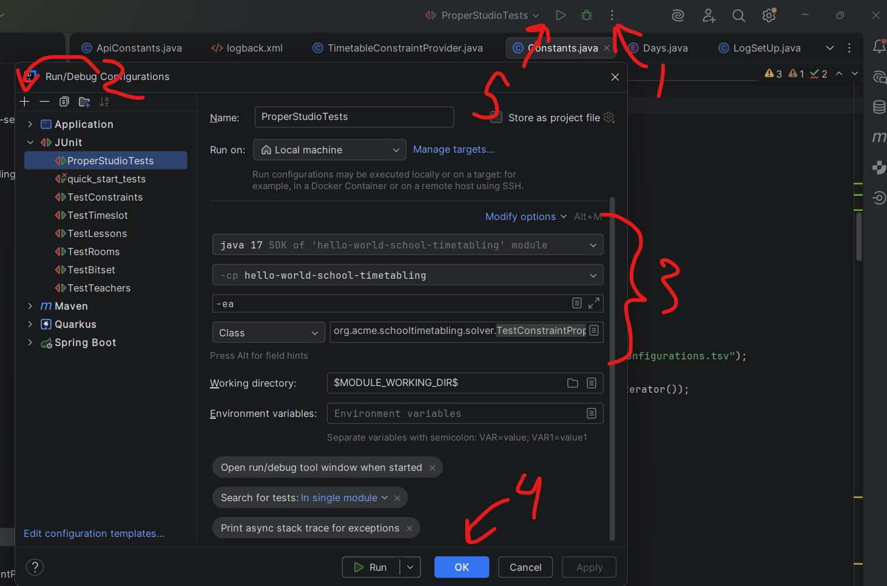

# The Java Constraint Engine Workplace
The following will assume you have everything setup mentioned in the project root `README.md` file.

# Important variables
__API connection__
- `baseURL`: [./src/main/java/org/acme/schooltimetabling/apiCalls/ApiConstants.java](./src/main/java/org/acme/schooltimetabling/apiCalls/ApiConstants.java)  
Any code realted to calling the endpoints will be in the apiCalls package.

You can toggle the usage of the api by modyfing the `useApi` option with `true` or `false` in the config file 
([example](./src/main/resources/constants/config.example.yaml)).

__Constants__  
Most constants used throughout the this tool will be found in 
[./src/main/java/org/acme/schooltimetabling/constants/Constants.java](./src/main/java/org/acme/schooltimetabling/constants/Constants.java).  
Those constants include:
- `COURSE_CONFIGS`: Course configurations
- `SPECIAL_CODE_CONVERSION`: converting course codes from their abbreviated to non-abbreviated version
- `SKIP_Schedule`: special codes that we don't want to schedule
- `SKIP_CONFIGURATIONS`: class configurations we don't want to schedule
- `CHOSEN_CONFIGURATIONS`: configurations we only want to schedule (this seemed to be recently added in the python version so I have it here);
- `COURSE_TO_ROOMS`: maps courses that are room specific to their allowed rooms
- `STUDIO_STYLE_COURSES`: courses marked as studio style
- `TEACHER_NAME_TO_CANON`: stores teachers mapped to their canon name
- `FACULTY_LAST_NAMES`: stores last names of people who are faculty

__Faculty times__
If you want to change what times faculty member shouldn't be scheduled during, go to the file 
[./src/main/java/org/acme/schooltimetabling/domain/teacher/Faculty.java](./src/main/java/org/acme/schooltimetabling/domain/teacher/Faculty.java).

__Console print out__  
There is variable I have that prints out a verbose breakdown of what constraints have been violated. 
You can toggle this using the `PRINT_DETAILED_SUMMARY` variable in the file 
[./src/main/java/org/acme/schooltimetabling/TimetableApp.java](./src/main/java/org/acme/schooltimetabling/TimetableApp.java).

# Problem objects
Classes containing planning entities (e.g. lessons) and planning variables (e.g. timeslots) can be found in the package
[./src/main/java/org/acme/schooltimetabling/domain/](./src/main/java/org/acme/schooltimetabling/domain/).
The classes that create instances of those objects are in the package
[./src/main/java/org/acme/schooltimetabling/helperClasses/Generators/](./src/main/java/org/acme/schooltimetabling/helperClasses/Generators/).

# Saving the results and logs
The result will be saved into a folder in your working directory called `generated` in a file such as `2268_csc_solution.xlsx`.
This excel file will contain 3 sheets. 
Those sheets will give you a view of when rooms are occupied, a view showing when instructors are busy, and list view of all the scheduled lessons. 
The list view will also contain lessons that couldn't be scheduled and lessons that were skipped.
Lessons that couldn't be scheduled are those violating hard constraints, except those violating the 50/50 primetime constraint used in the aggressive version of the solver.
More information about the solver config phases [here](#configuring-the-solver) and modyfing the constraints 
[here](#the-constraints).

To modify the logging output go to the file [./src/main/resources/logback.xml](./src/main/resources/logback.xml).
The logging outputs will be placed into a directory called `logs` in your working directory.

# Configuring the solver phases
To modify and tune the solver solving phases go to the this file [./src/main/resources/solverConfig.xml](./src/main/resources/solverConfig.xml). There are times when the solver might still get stuck and it's better to fail fast and restart it.

There are three phases:  
1. The construction heuristic phase. This phase initializes all problem facts in a planning entity (lessons), prioritizing lessons that require more lab time. 
To modify the priority go to the file
[./src/main/java/org/acme/schooltimetabling/domain/lesson/LessonComparator.java](./src/main/java/org/acme/schooltimetabling/domain/lesson/LessonComparator.java).
2. The local search phase: This phase will aim to bring the hard score down to 0 and ends the phase if achieved.
3. The local serach phase: Here I modify the heuristics so we can search more widely. 
It also keeps the solver from running too long if there hasn't been any improvments.

# The Constraints
To view all constrants go the file 
[./src/main/java/org/acme/schooltimetabling/solver/TimetableConstraintProvider.java](./src/main/java/org/acme/schooltimetabling/solver/TimetableConstraintProvider.java).

In the `config.yaml` you have the ability to use the following settings to control what constraints are added and how they will behave to a certain extent.
- `aggressiveChoice` (options: `NONE`, `AGGRESSIVE`, `AGGRESSIVE_BOTH`, `AGGRESSIVE_PENALTY`, `AGGRESSIVE_REWARD`)
    - `NONE`: models prime time as a soft contraint. Rewards time outside of it and penalizes time inside of prime time.
    - `AGGRESSIVE`: This will model prime time as a hard constraint. It will penalize only when 50%+ of lecture time is in primetime.
    - `AGGRESSIVE_BOTH`: Same as `AGGRESSIVE` + compresses all lectures into a certain time interval and penzalizes lessons outside the interval and reward lessons inside the interval. 
    I recommend using `AGGRESSIVE_PENALTY`.
    - `AGGRESSIVE_REWARD`: Same as `AGGRESSIVE_BOTH` but without the penalty.
    - `AGGRESSIVE_PENALTY`: Same as `AGGRESSIVE_BOTH` but without the rewarding. **The recommended one amongst the three**
- `compressStart` and `compressEnd`. 
These are used when we choose the `AGGRESSIVE_BOTH`, `AGGRESSIVE_PENALTY`, or `AGGRESSIVE_REWARD` solver options.
The time interval you choose will be the time interval the solver will attempt to squeeze all lessons into.

# Including prescheduled times
If instructors teach in multiple departments, you can include the times they have been already scheduled by providing a file.
The file should be a `json` placed in the [./src/main/resources/input/](./src/main/resources/input/) directory. 
An example of the file has been provided in the same directory your file should be placed.

Once your file containing prescheduled times is placed, create the key in your `config.yaml` named `prescheduledFileName` mapped to the value of your file name, as seen in this example [file](./src/main/resources/constants/config.example.yaml)

# Setting lab/act pattern
If a course contains a lab or activity you can set if the course should have all it's lab/act time all in one block of time
or spread out amongst various days. 
You can set the pattern for a course globally and/or per instructor.
Note, instructor choice takes precedence over global.
If a course has a lab/act and no pattern is given to the course, the default is **"Multiple"**

Time use this option you must include in your `config.yaml` they key name `patternsFileName` mapped the value of your
file name, which must be a JSON file. An example of the JSON format that is expected is given 
[here](./src/main/resources/input/coursePatterns.example.json). 

The only patterns available for a course are **"One"** and **"Multiple"**. 
If the pattern **"One"** is chosen and the course has lecture portion to it, the course will be split into two lessons. 
One lesson will have only the lecture units while the other lesson contains only the lab/act units. 
If the pattern **"Multiple"** is selected or defaulted to and the course has a lecture portion, 
the lecture units and lab/act units will be bundled together into a lesson instance.

Other things to consider:
- If a studio course instance is scheduled to have all it's lab/act time to be in **one** block, then the constraint
enforcing that lab/act time must be immediately after lecture will not be enforced for this lesson.

# Testing 
All testing classes can be found in the 
[solver](./src/test/java/org/acme/schooltimetabling/solver/) 
and 
[TestClasses](./src/test/java/org/acme/schooltimetabling/TestClasses/) package.

Before running any of these tests make sure that you have set testing option to `true` so all constraints are included and special test 
behavior is setup. Look at this 
[example](./src/main/resources/constants/config.example.yaml) 
config file. 

I have tried to include the configurations for running the tests, so try to hit the drop down menu you see next to the play button on step 5. 
Then choose the test you want to run. 
If there aren't any or there is a test you want to inlcude, follow the image guide below.

**Example setup in intellij**  
On step 1 you will see pop up. Select `edit` under configuration.  
On step 2 you will see a menu, and you should choose the `JUnit` option.  
On step 3 you will choose the same first 2 options and then choose the test class you want to run.

